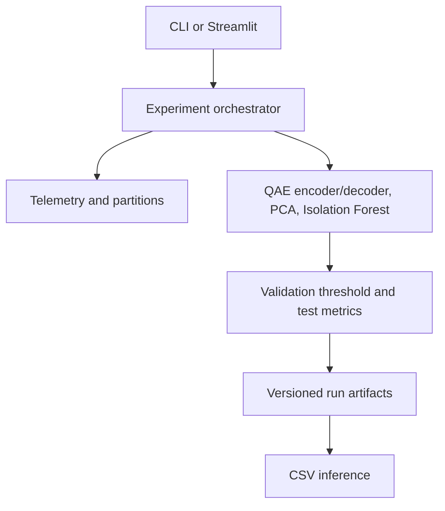

# Architecture

Created by School of AI and School of QC.

The package separates data generation, preprocessing, detector training, threshold selection,
artifact persistence, and inference. Both the CLI and Streamlit application call the same
`run_experiment` function, preventing a demo-only code path from diverging from the benchmark.

`data.py` owns the deterministic generator and leakage-resistant partitions. `preprocessing.py`
fits a `StandardScaler` only on clean training rows and amplitude-normalizes all splits.
`quantum_autoencoder.py` owns circuit construction, exact encoding, conditional latent-state
compression, inverse-unitary decoding, fidelity measurement, and COBYLA training.
`models.py` applies a shared score-normalization and threshold interface. `evaluation.py` owns
cost-sensitive selection and classification metrics. `artifacts.py` creates a complete audit
bundle, while `inference.py` reloads the exact scaler, models, ranges, and frozen thresholds.

The training partition contains only known-normal examples. Mixed validation data selects the
threshold. The mixed test partition is untouched until final scoring.

The QAE model exposes score_samples, compress, reconstruct, and reconstruction_fidelity through
one serializable weight/configuration object. Inference reloads that exact object; it does not
retrain or reselect thresholds. Each result also retains raw and normalized validation/test
scores so artifact generation never needs to recompute model behavior.
