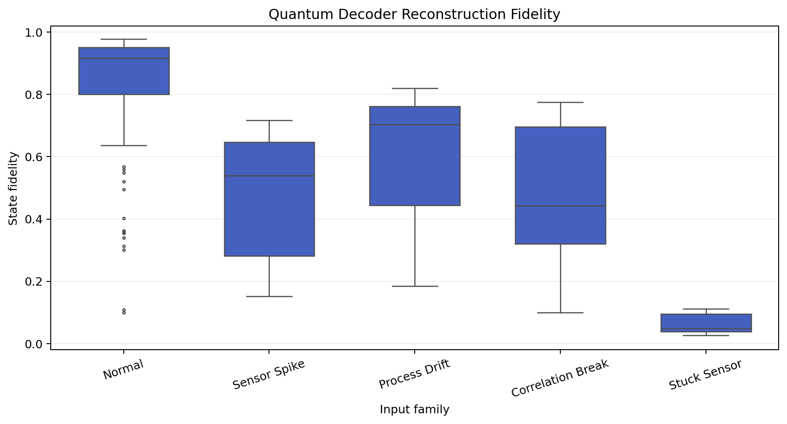
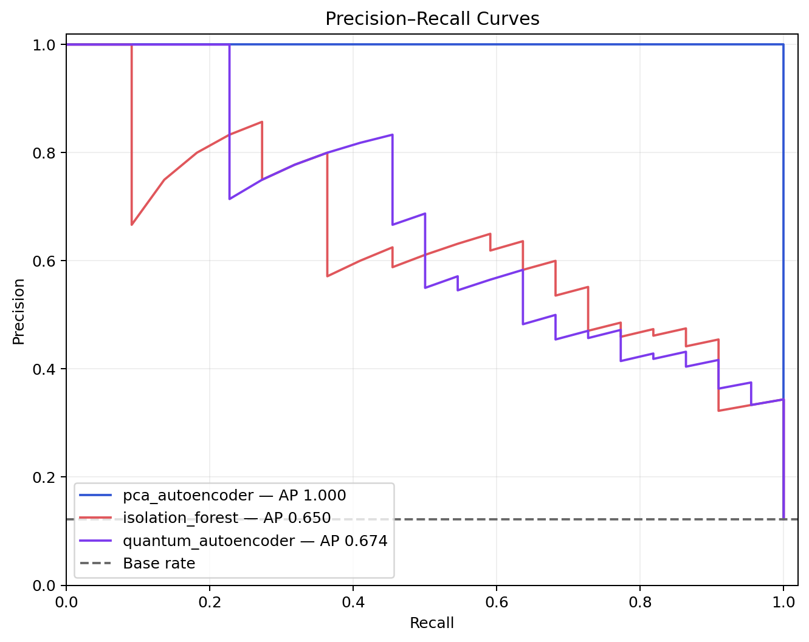

# Reference Results

Created by School of AI and School of QC.

## Frozen protocol

The reference evidence was generated on 2026-09-20 from configs/default.json with seed 42. The
dataset contains 900 deterministic synthetic telemetry rows, including 108 anomalies split
evenly across sensor-spike, process-drift, correlation-break, and stuck-sensor families.

Models fit only 475 clean-normal training rows. The QAE uses a deterministic 250-row subset.
Score ranges and cost-sensitive thresholds fit the 180-row mixed validation set. The 180-row
test set remains untouched until the frozen evaluation.

The configured threshold cost is five units for a false negative and one unit for a false
positive. These are illustrative units, not business estimates.

## Quantum autoencoder

The QAE used three input qubits, one latent qubit, two trash qubits, 18 parameters, six CX
gates, and 100 COBYLA objective evaluations. It reduced the state dimension from eight to two,
a 75% conditional latent-space reduction.

Held-out measurements:

- ROC AUC: 0.9281
- Average precision: 0.6739
- Precision: 0.4318
- Recall: 0.8636
- F2: 0.7197
- False positives: 25
- False negatives: 3
- Configured cost: 40
- Mean normal reconstruction fidelity: 0.8404
- Mean anomaly reconstruction fidelity: 0.3924
- Fidelity gap: 0.4480

The fidelity separation is directionally consistent with the objective: normal inputs usually
fit the learned compressed subspace better. It is not complete separation, so a threshold still
trades false alarms against missed anomalies.

## Classical controls

The PCA reconstruction control achieved ROC AUC 1.0000, average precision 1.0000, precision
1.0000, recall 0.9545, and configured cost 5. It was the strongest detector on this synthetic
generator.

Isolation Forest achieved ROC AUC 0.9312, average precision 0.6495, precision 0.4348, recall
0.9091, and configured cost 36.

The result is intentionally not framed as quantum advantage. PCA's decisive win shows why every
QML experiment needs serious classical controls under identical partitions and threshold rules.

## Anomaly-family behavior

Mean QAE reconstruction fidelity was 0.4714 for sensor spikes, 0.5695 for process drift, 0.4716
for correlation breaks, and 0.0644 for stuck-sensor corruption. The sample counts per family are
small, so these values describe this one frozen split rather than stable population estimates.

The exact per-family raw scores, normalized scores, and flagged rates are stored in
examples/reference-run/anomaly_type_performance.csv.

## Reproducibility boundary

The curated evidence records configuration, environment, circuit diagnostics, optimizer
termination, thresholds, metrics, per-family results, and objective history. Timing values are
machine-dependent. Metric values are deterministic for the recorded software and seed, but
library upgrades may change optimization or Isolation Forest details.

These results are a software-reproducibility checkpoint, not evidence about real machinery,
large-scale quantum compression, or a quantum device.
